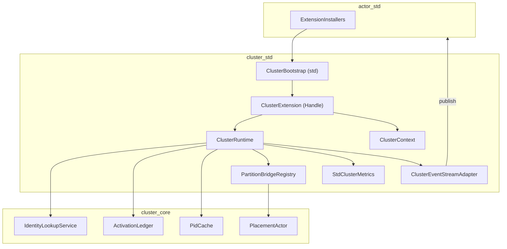
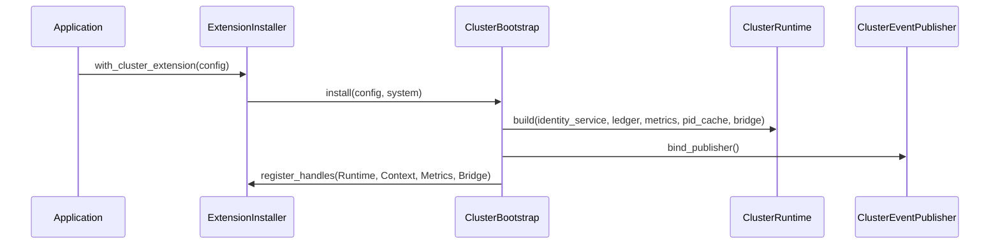
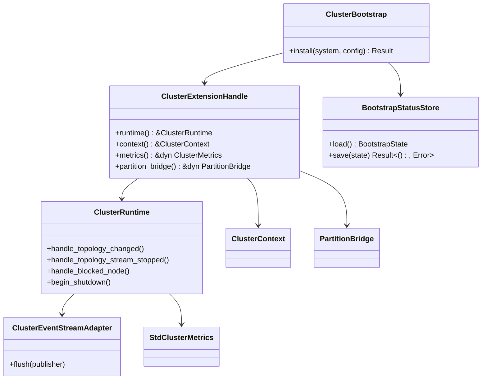

# cluster-extension-bootstrap 設計

## 概要
ClusterExtension を ActorSystem に無停止で組み込み、Topology 監視・Placement・Routing・観測を一貫させるブートストラップ経路を提供する。利用者は ExtensionInstaller への一行追加でクラスタ機能（IdentityLookup、Placement、ClusterContext、EventStream/metrics）を安全に有効化できる。ターゲットは fraktor 既存アプリ／ライブラリ開発者およびテスト/検証環境の運用者。

### 目標 (Goals)
- ClusterExtension を標準の Installer で有効化し、ClusterRuntime/Context/PartitionBridge/metrics へのハンドルを公開する。
- TopologyStream/BlockList を監視し、リース・キャッシュ・イベントの整合を維持する。
- Graceful Shutdown/Ownership 変更も含めた終端処理を deterministic に完了させる。
- 観測性: ClusterEvent を EventStream 経由で配信し、std 環境で metrics を公開する。

### 非目標 (Non-Goals)
- Gossip/MemberList 実装そのものは対象外（既存プロバイダを想定）。
- 永続ストレージへのリース保存は後続フェーズ。
- Remoting 以外の外部プロトコル追加（PubSub 等）は対象外。

## アーキテクチャ

### 既存アーキテクチャの把握
- 層構造: utils → actor → cluster（core/no_std, std）→ remote。mod.rs 禁止・1ファイル1型・tests.rs 分離。
- EventStream は actor/core に存在し、std で adapter/subscriber を提供。
- cluster/core には IdentityLookupService・ActivationLedger・PlacementActor・ClusterContext 等があり、拡張導線（ExtensionInstaller）未実装。

### ハイレベルアーキテクチャ


### 技術スタック / 設計判断
- 既存スタックに準拠（no_std core, std 拡張）。Installer/Bootstrap は std 側に配置して core の `cfg_std_forbid` を回避。
- Metrics は既存 `StdClusterMetrics` を拡張し、resolve/request/actor-count/blocklist/retry/timeout を計測。Otel 連携は hook だけ定義し、Telemetry 実装は別ファイルで差し替え可能にする。
- ClusterEvent は core で定義済み。EventStream 発火は std adapter に集約し、core からは queue に enqueue するだけにする。

#### 主要設計判断
- **Decision**: Installer/Bootstrap を std 階層に新設し、core は最小限のインターフェイス拡張に留める。  
  **Selected**: コード分離で no_std を汚さず、責務とテスト境界を明確化。  
  **Trade-offs**: 新規ファイルは増えるが、既存 core ロジックへの影響を最小化。

## システムフロー

### ブートストラップシーケンス


### Topology/BlockList/Shutdown フロー（抜粋）
- TopologyStream 更新: Bootstrap が購読し、IdentityLookupService に `update_topology(&TopologySnapshot)`、Runtime が `handle_topology_changed` で cache/lease を整合。ハッシュ不変時は ownership/pid_cache を再利用し再計算をスキップ。
- TopologyStream 終了: `TopologyStreamHandle` が終了シグナルを返したら Runtime `handle_topology_stream_stopped` を呼び、警告ログ＋直近スナップショット保持。再購読/バックオフポリシーは BootstrapConfig で指定し、再購読成功後に `handle_topology_changed` を再実行。
- BlockList: Remote hook → Runtime `handle_blocked_node` → Ledger revoke + PidCache invalidate → EventAdapter publish BlockListApplied。
- Graceful Shutdown: Installer 経由の制御 API → Runtime `begin_shutdown` → Placement/Bridge に停止要求 → Ledger release → Metrics gauge 0 → 完了コールバック。

## API ブループリント
### 型・トレイト一覧（追加/変更）
- `cluster::std::bootstrap::ClusterBootstrap` (pub): Installer から呼ばれる組立役。
- `cluster::std::bootstrap::ClusterExtensionHandle` (pub): Runtime/Context/Metrics/Bridge への参照バンドル。
- `cluster::std::bootstrap::BootstrapState` (pub(crate)): Ready/Disabled/Error を保持。
- `cluster::std::bootstrap::BootstrapStatusStore` (pub trait): BootstrapState の永続化/照会を担う。
- `cluster::std::bootstrap::ClusterInstaller` (pub): `install(&ActorSystemConfigBuilder, ClusterBootstrapConfig)` を提供。
- `cluster::std::bootstrap::ClusterBootstrapConfig` (pub): TopologyStream, Retry, Metrics, PartitionBridge factory, BootstrapStatusStore を保持。
- `cluster::core::runtime::ClusterRuntime` (pub): 既存に API 追加（e.g., `handle_topology_changed`, `handle_topology_stream_stopped`, `surrender_ownership` を安定化）。
- `cluster::core::events::ClusterEventStreamAdapter` (pub): EventStream publish を std に隔離。
- `cluster::core::metrics::StdClusterMetrics` (pub): resolve/request latency, retry/timeout counter, actor-count gauge, blocklist counter。
- `PartitionBridgeRegistry` (pub(crate) std): PlacementActor とのブリッジを登録/取得。
- `TopologyStreamHandle` (pub): Topology 購読ハンドル（停止検知用）。

### シグネチャ スケッチ
```rust
// std/bootstrap
pub struct ClusterBootstrap;
impl ClusterBootstrap {
  pub fn install(
    system: &ActorSystem,
    config: ClusterBootstrapConfig,
  ) -> Result<ClusterExtensionHandle, ClusterBootstrapError>;
}

pub struct ClusterExtensionHandle {
  pub fn runtime(&self) -> &ClusterRuntime<StdToolbox>;
  pub fn context(&self) -> &ClusterContext<StdToolbox>;
  pub fn metrics(&self) -> &dyn ClusterMetrics;
  pub fn partition_bridge(&self) -> &dyn PartitionBridge<StdToolbox>;
}

pub trait PartitionBridgeFactory {
  fn build(&self, system: &ActorSystem) -> Arc<dyn PartitionBridge<StdToolbox>>;
}

pub trait BootstrapStatusStore {
  fn load(&self) -> BootstrapState;
  fn save(&self, state: BootstrapState) -> Result<(), BootstrapStatusError>;
}

// core/runtime
impl<TB: RuntimeToolbox> ClusterRuntime<TB> {
  pub fn handle_topology_changed(&self, snapshot: &TopologySnapshot) -> Vec<ClusterIdentity>;
  pub fn handle_topology_stream_stopped(&self);
}

// std/metrics
pub trait ClusterMetrics {
  fn record_resolve_latency(&self, identity: &ClusterIdentity, dur: Duration);
  fn record_request_latency(&self, identity: &ClusterIdentity, dur: Duration);
  fn record_retry(&self, identity: &ClusterIdentity, attempts: u32, outcome: RetryOutcome);
  fn record_blocklist(&self, node: &NodeId);
  fn set_actor_count(&self, count: usize);
}
```

## クラス／モジュール図


## クイックスタート / 利用例
```rust
fn enable_cluster(system: &ActorSystem) -> ClusterExtensionHandle {
  let topo = MyTopologyProvider::default().watch(); // implements TopologyStream
  let config = ClusterBootstrapConfig::new(topo)
    .with_retry(RetryPolicy::default())
    .with_partition_bridge_factory(MyBridgeFactory);
  ClusterBootstrap::install(system, config).expect("cluster install")
}
```

## 旧→新 API 対応表

| 旧 | 新 | 置換手順 | 備考 |
| --- | --- | --- | --- |
| Cluster 未対応 | `ClusterBootstrap::install` | Installer に一行追加 | feature gate `cluster-extension-bootstrap` |
| Topology 手動更新 | TopologyStream 購読 | Provider から `TopologyStream` を渡す | 終了検知を保持 |
| EventStream 手動 publish | `ClusterEventStreamAdapter::flush` 経由 | Runtime から enqueue → std adapter が publish | 観測を std に集約 |

## 要件トレーサビリティ

| 要件ID | 実装コンポーネント | インターフェイス | 参照フロー |
| --- | --- | --- | --- |
| 1.1–1.4 | ClusterBootstrap, ClusterExtensionHandle | install(), runtime/context accessors | ブートストラップ図 |
| 1.5 | BootstrapStatusStore, ClusterExtensionHandle | 状態永続化＋クエリ API | ブートストラップ図 |
| 2.1–2.4 | IdentityLookupService, ClusterRuntime | update_topology(), handle_topology_changed(), handle_topology_stream_stopped() | Topologyフロー |
| 3.1–3.5 | PartitionBridgeRegistry, PlacementActor, ClusterRuntime | dispatch_activation_request(), begin_shutdown() | Placement/Shutdown |
| 4.1–4.5 | ClusterEventStreamAdapter, StdClusterMetrics | flush(), record_* | 観測フロー |

## コンポーネント & インターフェイス

### Bootstrap（std）
- 責務: Installer 入口。TopologyStream 購読、Runtime/Context の生成、PartitionBridgeFactory 呼び出し、Event/Metrics 配線、BootstrapState 保持。
- 入出力: `ClusterBootstrapConfig` → `ClusterExtensionHandle`。エラー時は `ClusterBootstrapError`（InvalidConfig/PartitionBridgeFailed/TopologyUnavailable）。
- 依存: ActorSystem, StdToolbox, PartitionBridgeFactory, StdClusterMetrics。
- 永続化: `BootstrapStatusStore`（trait）で `Ready/Disabled/Error{reason}` を永続化。install 前に load し、Disabled/Ready は早期判定、Error は理由付きで fail-fast。デフォルトは in-memory、ファイル/KV/actor state などへ差し替え可能。

### Runtime 拡張（core）
- `handle_topology_changed(&self) -> Vec<ClusterIdentity>`: 現行ハッシュと異なる PID を無効化。
- `handle_topology_stream_stopped(&self)`: TopologyStream 終了を警告ログし、直近スナップショットを保持したまま待機。再購読ハンドルを返す/再開 API を呼べるようにする。
- ハッシュ不変ガード: トポロジハッシュが変化しない間は ownership/pid_cache を再利用し、無効化や再計算をスキップ。
- `surrender_ownership` / `begin_shutdown`: Releasing/Released 遷移を統合し、ClusterError を返す。
- 観測: Metrics へ gauge/latency を反映し、ClusterEventPublisher に enqueue。

### EventStreamAdapter（std）
- 責務: ClusterEventPublisher キューを EventStreamEvent::Log/Cluster 変換して publish。
- インターフェイス: `flush(&self, publisher: &ClusterEventPublisher<TB>)`.

### Metrics（std）
- `StdClusterMetrics`: resolve/request latency、retry count、timeout count、blocklist count、actor-count gauge。Mutex poison は Early-return にしパニック回避。
- ClusterContext のリトライループから `record_retry(identity, attempts, outcome: RetryOutcome)` を呼び、上限超過で Timeout カウンタをインクリメント。
- Otel hook: `try_export(&self, telemetry: &dyn TelemetrySink)` （将来の拡張用、デフォルト no-op）。

### PartitionBridgeRegistry（std）
- 責務: PlacementActor へのブリッジ生成と登録。複数 bridge を扱う余地を残す。
- インターフェイス: `register(&self, Arc<dyn PartitionBridge<StdToolbox>>)`、`primary(&self) -> Arc<dyn PartitionBridge<StdToolbox>>`.

## エラーハンドリング
- Bootstrap: InvalidConfig/TopologyUnavailable/BridgeCreateFailed を `ClusterBootstrapError` で返却し、Installer は起動前に fail-fast。
- BootstrapStatusStore: save/load 失敗時は `ClusterBootstrapError::StatusStore` を返し、拡張有効化をブロック。
- Runtime: `ClusterError::ShuttingDown/OwnershipChanged/Blocked/Timeout` を返し、EventStream に警告を流す。
- TopologyStream 終了: `handle_topology_stream_stopped` で warning ログ出力し、最後のスナップショットを保持したまま `TopologyStreamHandle` 再購読を試行。
- Metrics/Adapter: ロック失敗時は warn ログ＋処理継続、パニック禁止。

## テスト戦略
- ユニット: Bootstrap config バリデーション、BootstrapStatusStore（load/save）永続化、PartitionBridgeRegistry 登録、StdClusterMetrics 計測（retry/timeout 含む）、EventStreamAdapter flush。
- 統合: ブートストラップ経由で TopologyStream → resolve → Activation → BlockList → Shutdown を一連で実行する std テスト。TopologyStream 終了シグナル後の警告・再購読・最新 snapshot 維持を検証。
- フェイルケース: 無効 config、StatusStore 失敗、TopologyStream 終了、PartitionBridge 生成失敗。

## 移行戦略
- 段階導入: feature gate `cluster-extension-bootstrap`。既存アプリは Installer に追加したときのみ影響。
- ロールバック: Installer からエントリを外すだけで無効化。Runtime ハンドルが未生成ならクラスタ機能は起動しない。
