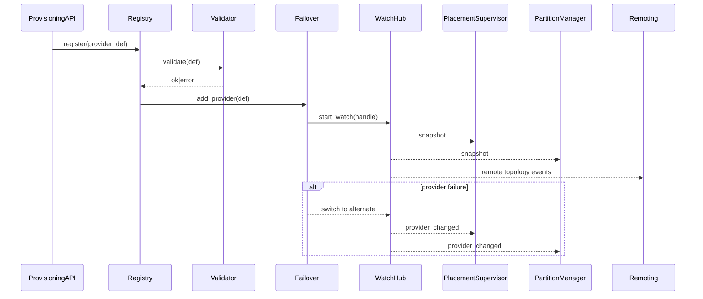
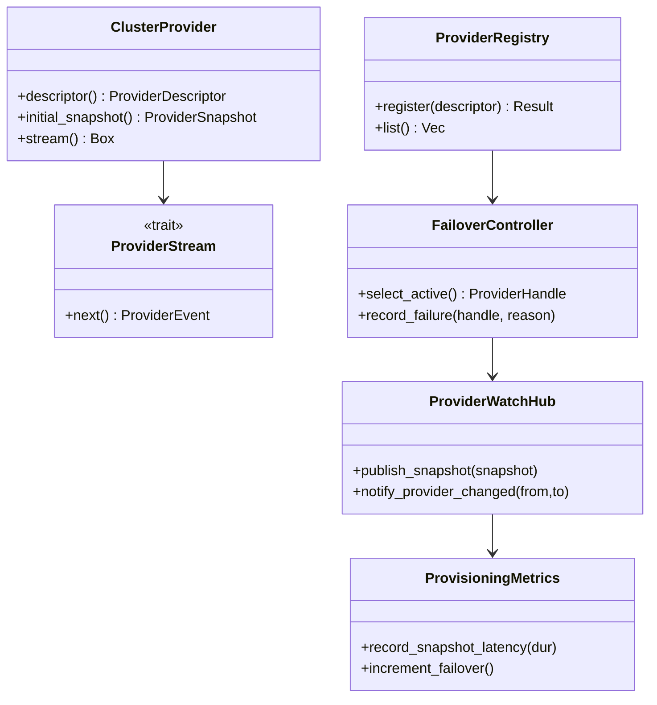

# cluster-provisioning-providers 設計

## 概要
ClusterProvisioning Service を std 層に新設し、複数 ClusterProvider（in-memory/Consul/K8s 等）の登録・監視・フェイルオーバを統合する。core には最小限の Provider 抽象のみを追加し、外部依存は std/provisioning に隔離する。PlacementSupervisor / PartitionManager / Remoting へはイベント契約とメトリクスを通じて連携し、プロビジョニング経路の可観測性とフェイルセーフを確保する。

### 目標 (Goals)
- 複数プロバイダ登録・検証と永続化を提供し、起動前に無効設定を遮断する。
- トポロジスナップショットを安定供給し、フェイルオーバ／優先度制御を備えた Watch 経路を提供する。
- PlacementSupervisor/PartitionManager/Remoting へ一貫したイベントとメトリクスを配信する。

### 非目標 (Non-Goals)
- プロバイダ実装の詳細（Consul/K8s client 実装）は別フェーズ。
- Gossip/MemberList 自体の実装は対象外。
- 永続ストレージスキーマの最適化（将来フェーズで検討）。

## アーキテクチャ

### 既存アーキテクチャの把握
- core/config に単一 `TopologyWatch`。cluster/std には bootstrap と metrics のみ。
- utils → actor → cluster(core) → cluster(std) の層構造、1ファイル1型、mod.rs 禁止。
- EventStream/ClusterEvent、StdClusterMetrics は既存インフラとして再利用。

### ハイレベルアーキテクチャ
```mermaid
graph TB
  subgraph std_provisioning
    Registry[ProviderRegistry]
    Validator[ProviderValidator]
    Failover[FailoverController]
    WatchHub[ProviderWatchHub]
    Metrics[ProvisioningMetrics]
    Events[ProvisioningEventPublisher]
  end

  subgraph core_provisioning
    ProviderTrait[ClusterProvider (trait)]
    Snapshot[ProviderSnapshot]
    Stream[ProviderStream]
    Health[ProviderHealth]
  end

  Registry --> Validator
  Registry --> Failover
  Failover --> WatchHub
  WatchHub -->|Snapshot| PlacementSupervisor
  WatchHub -->|Snapshot| PartitionManager
  WatchHub -->|RemoteTopologyEvent| Remoting
  WatchHub --> Metrics
  WatchHub --> Events

  ProviderTrait --> Snapshot
  ProviderTrait --> Stream
  ProviderTrait --> Health
```

### 技術スタック / 設計判断
- **Provider 実装**: std 側で in-memory/Consul/K8s に差し替え可能な trait 実装を想定。K8s は `kube-runtime` の `watcher` を利用、Consul は blocking query を使用。
- **フェイルオーバ**: 優先度付きヘルス判定＋バックオフを FailoverController が管理。ヘルス判定入力は (watch 無応答タイムアウト、連続エラー回数、スナップショット遅延)。デフォルト: timeout 15s、max_errors 3、backoff 初期 2s・指数(×2)・上限 30s、クールダウン 10s。
- **イベント/メトリクス**: 既存 ClusterEvent/StdClusterMetrics を拡張し、プロバイダ系イベントとメトリクスを追加。

#### 主要設計判断
- **Decision**: 新規 std/provisioning サブモジュールを追加し、core は抽象のみ保持。  
  **Context**: 複数プロバイダと外部バックエンド対応が std 依存であるため。  
  **Alternatives**: ClusterConfig 拡張 (Option A)／ハイブリッド (Option C)。  
  **Selected Approach**: Option B。Registry/WatchHub/Failover を std に新設し、core には Provider 抽象を追加。  
  **Rationale**: no_std 汚染を避け、責務分離とテスト容易性を確保。  
  **Trade-offs**: 新規ファイル増・ブリッジ設計の複雑化。

## システムフロー
### プロバイダ登録〜フェイルオーバ シーケンス


## API ブループリント

### 型・トレイト一覧
- `core::provisioning::ClusterProvider` (trait, pub): snapshot/watch 提供。 
- `core::provisioning::ProviderSnapshot` (struct, pub): members: Vec<ClusterNode>, hash, health, blocked.
- `core::provisioning::ProviderStream` (trait, pub): topology イベントストリーム抽象。
- `core::provisioning::ProviderHealth` (enum, pub): Healthy/Degraded/Unreachable。
- `std::provisioning::ProviderRegistry` (struct, pub): provider 登録・永続化・衝突検知。
- `std::provisioning::ProviderValidator` (struct, pub(crate)): 接続検証・必須項目検証。
- `std::provisioning::FailoverController` (struct, pub): 優先度付きヘルス監視とフェイルオーバ制御。
- `std::provisioning::ProviderWatchHub` (struct, pub): スナップショット配信と終了シグナル保持。
- `std::provisioning::ProvisioningMetrics` (struct, pub): snapshot latency, failover count, stream interruption など。
- `std::provisioning::ProvisioningEventPublisher` (struct, pub): provider_changed / remote_topology イベント発行。
- `std::provisioning::ProviderStore` (trait, pub): ProviderDescriptor を原子的に保存/読込する永続化抽象。

### シグネチャ スケッチ
```rust
// core
pub trait ClusterProvider {
  fn descriptor(&self) -> ProviderDescriptor;
  fn initial_snapshot(&self) -> ProviderSnapshot;
  fn stream(&self) -> Box<dyn ProviderStream>;
}

pub trait ProviderStream: Send + Sync {
  fn next(&mut self) -> Option<ProviderEvent>;
}

pub enum ProviderEvent {
  Snapshot(ProviderSnapshot),
  Terminated { reason: ProviderTermination },
}

pub struct ProviderSnapshot {
  pub members: Vec<ClusterNode>,
  pub hash: u64,
  pub blocked_nodes: Vec<NodeId>,
  pub health: ProviderHealth,
}

// std
pub struct ProviderRegistry;
impl ProviderRegistry {
  pub fn register(&self, descriptor: ProviderDescriptor) -> Result<(), ProvisioningError>;
  pub fn save(&self) -> Result<(), ProvisioningError>;
  pub fn load(&self) -> Result<(), ProvisioningError>;
  pub fn list(&self) -> Vec<ProviderDescriptor>;
}

pub trait ProviderStore {
  fn load_descriptors(&self) -> Result<Vec<ProviderDescriptor>, ProvisioningError>;
  fn save_descriptors(&self, descriptors: &[ProviderDescriptor]) -> Result<(), ProvisioningError>;
}

pub struct FailoverController;
impl FailoverController {
  pub fn select_active(&self) -> Option<ProviderHandle>;
  pub fn record_failure(&self, provider: &ProviderHandle, reason: FailureReason);
}

pub struct ProviderWatchHub;
impl ProviderWatchHub {
  pub fn attach_consumers(&self, ps: Arc<PlacementSupervisorBridge>, pm: Arc<PartitionManagerBridge>, rem: Arc<RemotingBridge>);
  pub fn publish_snapshot(&self, snapshot: ProviderSnapshot);
  pub fn notify_provider_changed(&self, from: ProviderId, to: ProviderId);
}

pub struct ProvisioningMetrics;
impl ProvisioningMetrics {
  pub fn record_snapshot_latency(&self, dur: Duration);
  pub fn increment_failover(&self);
  pub fn increment_stream_interrupt(&self);
}

pub struct ProvisioningEventPublisher;
impl ProvisioningEventPublisher {
  pub fn provider_changed(&self, from: ProviderId, to: ProviderId, reason: ProviderFailoverReason);
  pub fn remote_topology(&self, event: RemoteTopologyEvent);
}
```

## クラス／モジュール図


## クイックスタート / 利用例
```rust
fn enable_provisioning(system: &ActorSystem) {
  let registry = ProviderRegistry::new();
  registry.register(ProviderDescriptor::in_memory("local"));
  registry.register(ProviderDescriptor::consul("consul", consul_config));

  let provisioning = ClusterProvisioningService::build(registry)
    .with_failover(FailoverPolicy::priority())
    .with_metrics(ProvisioningMetrics::default());

  provisioning.start(system).expect("provisioning start");
}
```

## 旧→新 API 対応表

| 旧 | 新 | 置換手順 | 備考 |
| --- | --- | --- | --- |
| `ClusterConfig.topology_watch` 1本 | ProviderRegistry + FailoverController | ClusterConfig で provisioning feature を有効化し、Registry に複数 provider を登録 | 単一 Watch は互換の in-memory provider で代替 |
| なし | ProviderWatchHub | Placement/Partition/Remoting への配信ハブ | 終了シグナル保持とフェイルオーバ通知を統合 |

## 要件トレーサビリティ

| 要件ID | 実装コンポーネント | インターフェイス | 参照フロー |
| --- | --- | --- | --- |
| 1.1–1.5 | ProviderRegistry, ProviderValidator, ProvisioningError | register(), validate() | プロバイダ登録シーケンス |
| 2.1–2.5 | ProviderStream, ProviderWatchHub, FailoverController | next(), publish_snapshot() | トポロジウォッチ/フェイルオーバ |
| 3.1–3.5 | ProviderWatchHub, PlacementSupervisorBridge, PartitionManagerBridge | publish_snapshot(), notify_provider_changed() | Placement/Partition 連携 |
| 4.1–4.5 | ProvisioningEventPublisher, RemotingBridge | RemoteTopology events | Remoting 連携 |
| 5.1–5.5 | ProvisioningMetrics, ProvisioningError | record_snapshot_latency(), error codes | 観測・フェイルセーフ |

## コンポーネント & インターフェイス

### core::provisioning
- 責務: プロバイダ抽象（スナップショット、ストリーム、ヘルス）。
- 入出力: ProviderSnapshot / ProviderEvent。
- 依存: ClusterNode, NodeId (既存)。外部依存なし。

### std::provisioning
- 責務: Registry/Validator/Failover/WatchHub/イベント・メトリクス配信。
- 入出力: ProviderDescriptor、ProviderHandle、ProviderEvent → Placement/Partition/Remoting ブリッジ。
- 外部依存: Consul client (blocking query, index reset への注意), kube-runtime watcher (自動リストア付き)。
- 永続化: ProviderStore を実装する FileProviderStore を標準実装とし、`providers.jsonl.tmp` へ書き出し→fsync→rename の順で原子更新。読込時は JSON Lines を検証し、破損時はエラーで起動を fail-fast。

#### イベント契約
- `provider_changed`: fields {from_provider_id, to_provider_id, reason(enum: Timeout|HealthDegraded|ManualOverride), seq_no, snapshot_hash}。冪等キー = seq_no。順序は WatchHub 発行順を保持し、at-least-once 配信を前提にブリッジ側で重複除去。
- `remote_topology`: fields {event(Join|Leave|Blocked|Unblocked), node_id, provider_id, snapshot_hash, seq_no}。冪等キー = (provider_id, seq_no)。順序乱れ時は snapshot_hash で新旧を判定し、古いイベントを破棄。

#### 契約定義（例）
```rust
pub trait ProviderValidator {
  fn validate(&self, descriptor: &ProviderDescriptor) -> Result<(), ProvisioningError>;
}

pub trait PlacementSupervisorBridge {
  fn apply_snapshot(&self, snapshot: ProviderSnapshot);
  fn provider_changed(&self, from: ProviderId, to: ProviderId);
}

pub trait RemotingBridge {
  fn publish_remote_topology(&self, event: RemoteTopologyEvent);
}
```

### ドメインモデル
- ProviderDescriptor: id, kind(in-memory/consul/k8s/custom), priority, endpoints, auth, watch_params。
- ProviderHealth: Healthy/Degraded/Unreachable と last_heartbeat。
- ProviderTermination: Ended|Errored{reason}。
- RemoteTopologyEvent: Join/Leave/Blocked/Unblocked。

## データモデル
- 永続化 (std 層設定ストア): ProviderDescriptor を JSON Lines で `providers.jsonl` に保存し、`tempfile` + rename による原子的置換。fsync で durability を確保。将来的に KV (sled/etcd) に差し替え可能な ProviderStore trait で抽象化。
- スナップショット: members(Vec<ClusterNode>), hash(u64), etag/index, blocked_nodes(Vec<NodeId>)。

## エラーハンドリング
- 検証エラー: InvalidConfig, DuplicateName。
- 接続エラー: BackendUnavailable, Timeout, IndexRollback (Consul index 巻き戻り対策として index reset 指定)。
- フェイルオーバ: ProviderUnhealthy で優先度順に切替、全滅時は provisioning-unavailable を発火。

## テスト戦略
- ユニット: Registry 重複検知、Validator 必須項目、Failover 優先度/バックオフ（タイムアウト/エラー閾値/クールダウン）、WatchHub 終了シグナル保持、ProvisioningMetrics 記録、FileProviderStore の save/load 破損検出と fail-fast。
- 統合: in-memory + mock provider で登録→watch→フェイルオーバ→Placement/Remoting 通知フロー。Consul/K8s モックで接続失敗・index 巻き戻り・再接続を確認。
- 負荷: 大規模スナップショット（ノード数1k）でフェイルオーバ時の遅延測定。

## セキュリティ
- 外部バックエンド認証情報は std 層で保持し、core には流さない。Secret は ProviderDescriptor とは別チャネルで渡す（設計で暗号化ストアを検討）。

## パフォーマンス & スケーラビリティ
- K8s watcher (kube-runtime) の自動リストアを利用し、バックオフ設定を FailoverPolicy で調整。
- Consul blocking query は index 巻き戻り検知で再同期。

## 移行戦略
- 互換 in-memory provider を default とし、既存単一 TopologyWatch から段階移行。feature flag `provisioning-providers` で切替。Bootstrap 時に Registry 未設定なら従来経路を維持。
