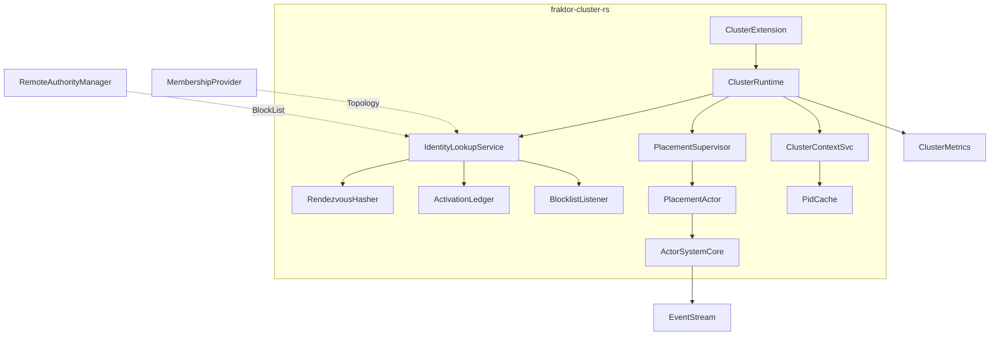
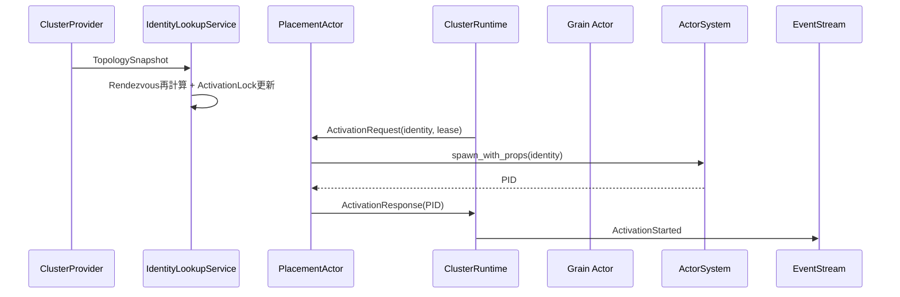
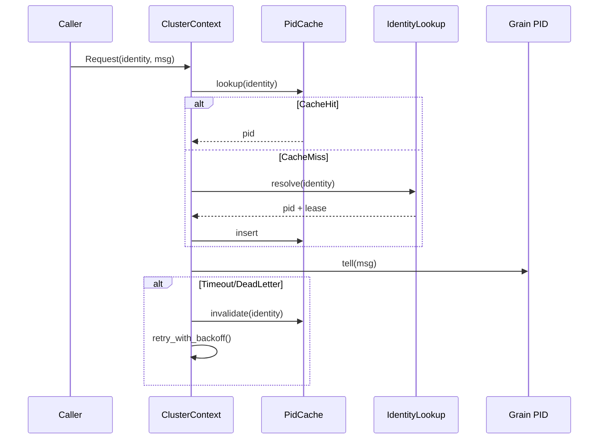
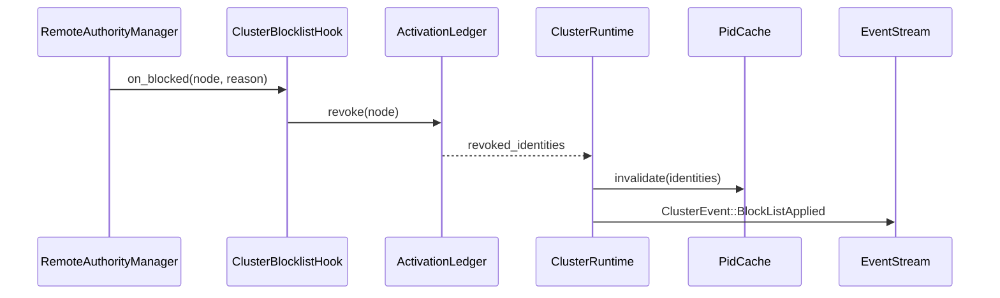
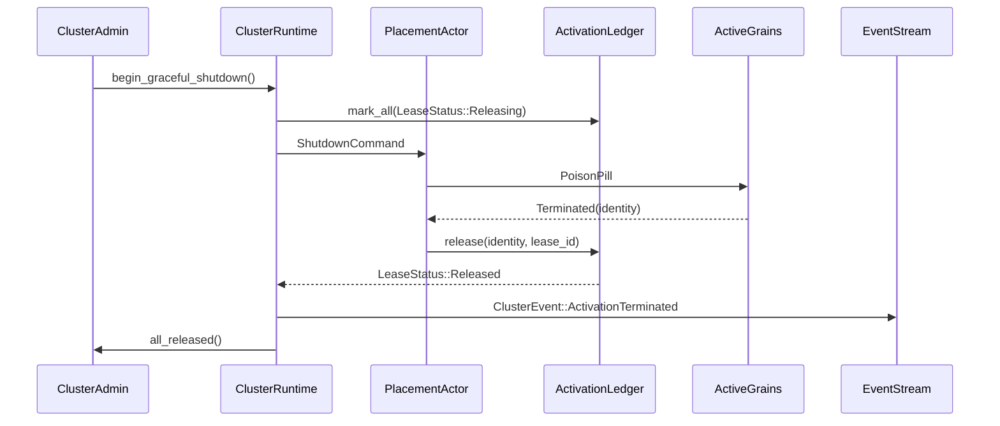
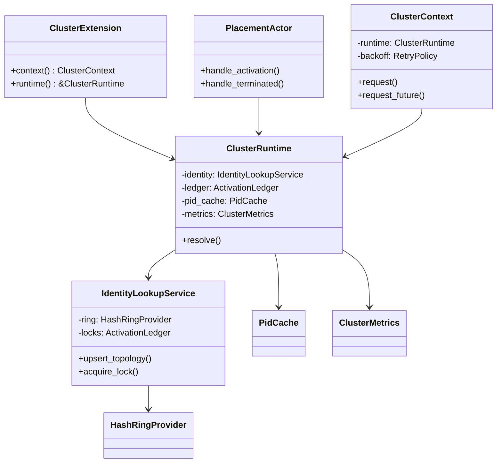

# 設計ドキュメントテンプレート

## 概要
本設計は `fraktor-cluster-rs`（新設予定）によって VA (Virtual Actor) の IdentityLookup/Placement/Routing を Rust 版 Proto.Actor へ導入する。クラスタ利用者は Consul や K8s 由来のメンバー情報を入力すると、Rendezvous ハッシュで所有ノードを確定し、PlacementActor が仮想アクターを生成・終了し、ClusterContext が透過的に PID ルーティングとリトライを行う。Impact として ActorSystem の Extension 群に ClusterExtension が追加され、EventStream/metrics/Remoting へ観測イベントを送出する。

### 目標 (Goals)
- Rendezvous/Weighted ハッシュを使った決定的な ClusterIdentity → 所有ノード解決を実現する。
- Placement/Partition 層が Activation ロックと Terminated ブロードキャストを制御する。
- ClusterContext/PidCache が Request/RequestFuture をリトライ＋計測付きで多段化する。
- EventStream/metrics へ ActivationStarted/ActivationTerminated/BlockListApplied を供給する。

### 非目標 (Non-Goals)
- Gossip/MemberList/ClusterProvider 実装そのもの（後続フェーズで追加）。
- PubSub/Grain コード生成・IDL 連携（現行 Proto.Actor との互換性検討は別 spec）。
- 外部永続ストア (etcd/Redis) への activation 状態保存（Phase2 で検討）。

## アーキテクチャ

### 既存アーキテクチャの把握
- ActorSystem は ExtensionInstaller で Remoting/TickDriver などを注入可能。Extension ごとに `ExtendedActorSystem` から system guardian 配下で監視済みダイモンを起動する。
- RemotingExtension は endpoint supervisor＋RemoteActorRefProvider を所有し、RemoteAuthorityManager が BlockList／Quarantine を管理する。
- EventStream は Lifecycle/RemoteAuthority/TickDriver 等を多重配信するが、Cluster 専用イベントは未定義。
- `modules/actor`/`modules/remote` は no_std/core + std レイヤ構造。新機能も同パターンに従う必要がある。

### ハイレベルアーキテクチャ

- `fraktor-cluster-rs` は新規 crate。`core/` に ActorSystem 依存の最小実装、`std/` に Tokio/Otel/Serde 等を配置する。
- ClusterExtension は ExtensionInstaller で登録され、`ClusterConfig` を受け取って Runtime を生成する。
- IdentityLookupService が Rendezvous/Weighted ハッシュリングを構築し ActivationLock を配布する。
- PlacementSupervisor は system guardian の子俳優として PlacementActor を spawn し、ActivationRequest/Response を PID キャッシュへ中継する。
- ClusterContextSvc は Cluster 呼び出し専用の Context/Request API を公開し、PidCache と IdentityLookup の組み合わせでリトライ制御を行う。
- EventStream には Cluster イベントが publish され、StdClusterMetrics が OpenTelemetry histogram/counter を更新する。

### 技術スタック / 設計判断
- Rendezvous/Weighted hashing は `hash_rings` crate を採用し、CARP/Maglev など複数アルゴリズムを将来切り替え可能にする。`hash_rings` は軽量で Rendezvous 実装が揃っており no_std もサポートするため、新規実装より安全かつ高速にリングを構築できる。citeturn0search1
- ハッシュ関数には rapidhash を推奨（feature で hrw-hash/wyhash に差し替え可能）。rapidhash は SMHasher3 をパスする高速 non-cryptographic hash で、no_std 対応かつ最新 1.4.0 が 2025-02-19 にリリースされている。citeturn0search0
- `std::hash::Hasher` の安定性が保証されない点を踏まえ、Portable hashing は rapidhash の `rapidhash_v3` を固定 seed で呼び出す wrapper を提供してプラットフォーム差異を吸収する。Rust 標準 Hasher は将来の rustc 変更で出力が変わる可能性があるため、Hash trait へ丸投げしない設計とする。citeturn0search4
- Weighted Rendezvous の実装には `hrw-hash` のアルゴリズム知見（Logarithmic Method）を参考にし、ノードウェイトを設定可能にする。citeturn0search2
- 一貫した cross-language ノード選定の必要性は rustyhash でも強調されている。Rust 以外の実装と互換を取りたいユーザに備え、リング出力のポータブル性を最優先に設計する。citeturn0search7
- **MSRV/PoC 検証**: `hash_rings` は MSRV 1.77 を要求するため、nightly toolchain で PoC を最初にビルドし、問題があれば HashRingProvider trait で自前実装に切り替える fallback を即時検討する。設計時点で trait 差し替え可能な構成にしており、PoC の通過をデザイン完了条件に追加する。

#### 主要設計判断
1. **Decision**: ClusterExtension を独立 crate として追加する。
   - **Context**: RemotingExtension に機能追加すると責務が肥大化し、将来の Gossip/PubSub と干渉する。
   - **Alternatives**: RemotingExtension に統合 / modules/actor に直書き。
   - **Selected Approach**: `fraktor-cluster-rs` を追加し、ExtensionInstaller 経由で ActorSystem に登録。
   - **Rationale**: crate ごとの責務分離、no_std/std 二層構造の再利用、将来のクラスタ provider 追加が容易。
   - **Trade-offs**: クレート増によるビルド分割・CI 対応が必要。

2. **Decision**: Rendezvous hashing 実装として `hash_rings` + rapidhash wrapper を採用。
   - **Context**: 一貫性と weighted ノード対応、no_std 対応、ハッシュ品質の担保が必要。
   - **Alternatives**: 自前実装 / jump hash only / CARP 固定。
   - **Selected Approach**: HashRingProvider trait で `hash_rings` を包み、rapidhash を BuildHasher として注入。
   - **Rationale**: 実績ある実装を再利用し、新しいアルゴリズム切り替えを feature gate で制御可能。
   - **Trade-offs**: 外部 crate バージョン追従が必要、MSRV (1.77) 制約を確認する必要がある。

3. **Decision**: Activation 状態はメモリ内 Ledger と EventStream で管理し、永続化は非対象。
   - **Context**: 要件は Phase1 でクラスタ所有確定と PID ルーティングを求めているが、永続ストアは後続フェーズ。
   - **Alternatives**: etcd/Redis を初期から導入。
   - **Selected Approach**: `ActivationLedger` を ToolboxMutex で保護し、`ActivationLease`（ロック ID + 所有ノード + トポロジハッシュ）を記録。EventStream で状態遷移を公開し、外部ストレージは Optional Hook にする。
   - **Rationale**: 実装負荷を抑えつつ EventStream＋metrics で観測できる。フェールオーバー時も Rendezvous + ロック再取得で自動回復。
   - **Trade-offs**: プロセス再起動で Activation 状態が失われるため、後続フェーズで checkpoint hook を設計する必要がある。

## システムフロー

### Activation Lock / Placement フロー


### Request リトライフロー


### BlockList 適用フロー

Hook 内では (1) Ledger を更新し lease を Revoked に設定、(2) Runtime 経由で PidCache から当該 identity を削除、(3) EventStream へ BlockListApplied を publish する順序を保証する。PidCache は EventStream subscriber としても登録され、クライアントが独自にキャッシュしている場合に備えて二重の invalidation 経路を確保する。

### Graceful Shutdown フロー

Runtime は `LeaseStatus::Releasing` 中の identity への新規 Request を `ClusterError::ShuttingDown` で即座に拒否し、PidCache からも対象 PID を削除する。Timeout に達した場合は `LeaseStatus::TimedOut` を記録し再取得を許可する。

## API ブループリント

### 型・トレイト一覧
- `ClusterConfig` (pub): Rendezvous 設定、retry/backoff、メンバー更新チャネル、metrics 設定を保持。
- `ClusterExtension<TB>` (pub): `Extension<TB>` を実装し、Runtime/Placement/Context サービスを束ねる。
- `ClusterRuntime<TB>` (pub(crate)): IdentityLookupService、ActivationLedger、PidCache、Metrics ハンドルを保持。
- `ClusterProvider` (pub trait): 外部メンバーシップから `TopologyEvent` ストリームを供給。
- `TopologyEvent` (pub enum): Joined/Left/Blocked/Heartbeat。
- `IdentityLookupService<TB>` (pub(crate)): Rendezvous リングと ActivationLock を扱う。
- `ActivationLedger<TB>` (pub(crate)): `HashMap<ClusterIdentity, ActivationLease>`。
- `ActivationLease` (pub struct): `lease_id`, `owner`, `topology_hash`, `status`。
- `PlacementActor<TB>` (pub(crate)): system actor。ActivationRequest を受け Props + ClusterIdentity 付きで spawn。
- `ClusterContext<TB>` (pub struct): Request/RequestFuture API と backoff/metrics を実装。
- `PidCache<TB>` (pub struct): std 構成では `dashmap` + `ArcSwap`、core/no_std 構成では `ToolboxMutex<HashMap<_,_>>` ベースの shard map で identity→PID をキャッシュ。
- `ClusterEvent` (pub enum): ActivationStarted/ActivationTerminated/BlockListApplied/ActivationFailed。
- `ClusterMetrics` (trait): OTA counter/histogram を注入。std 実装 `StdClusterMetrics` が OpenTelemetry を利用。

### シグネチャ スケッチ
```rust
pub struct ClusterConfig {
    pub system_name: String,
    pub rendezvous: HashStrategy,
    pub retry: RetryPolicy,
    pub topology_rx: TopologyStream,
    pub allow_weighted_nodes: bool,
    pub metrics: ClusterMetricsConfig,
}

pub trait ClusterProvider {
    fn subscribe(&self) -> TopologyStream;
    fn shutdown(&self);
}

pub struct ClusterExtension<TB: RuntimeToolbox> {
    pub fn new(system: &ActorSystemGeneric<TB>, config: ClusterConfig) -> Self;
    pub fn context(&self) -> ClusterContext<TB>;
}

pub struct ClusterContext<TB: RuntimeToolbox> {
    pub async fn request(&self, identity: &ClusterIdentity, msg: AnyMessageGeneric<TB>) -> Result<AnyMessageGeneric<TB>, ClusterError>;
    pub fn request_future(&self, identity: &ClusterIdentity, msg: AnyMessageGeneric<TB>, timeout: Duration) -> ClusterFuture<TB>;
}

pub trait IdentityResolver {
    fn resolve(&self, identity: &ClusterIdentity, caller: NodeId) -> Result<ResolvedPid, ClusterError>;
    fn release(&self, identity: &ClusterIdentity, lease_id: LeaseId);
}

pub struct ActivationRequest {
    pub identity: ClusterIdentity,
    pub lease: ActivationLease,
    pub kind_props: PropsGeneric,
}

pub enum ClusterError {
    Timeout,
    NoSuchKind,
    OwnershipChanged,
    Blocked,
    ShuttingDown,
}

pub trait PartitionBridge {
    fn send_activation_request(&self, req: ActivationRequest) -> Result<(), ClusterError>;
    fn acknowledge_activation(&self, res: ActivationResponse);
    fn broadcast_activation_event(&self, evt: ClusterEvent);
}

pub struct ActivationResponse {
    pub identity: ClusterIdentity,
    pub pid: Option<Pid>,
    pub lease_id: LeaseId,
    pub topology_hash: u64,
    pub error: Option<ClusterError>,
}
```

## クラス／モジュール図


## クイックスタート / 利用例
```rust
fn bootstrap_cluster(system: &ActorSystem, provider: impl ClusterProvider + 'static) {
    let installers = ExtensionInstallers::default().with_extension_installer(|sys| {
        let config = ClusterConfig::builder()
            .system_name("fraktor-dev")
            .with_provider(provider.subscribe())
            .with_rendezvous(HashStrategy::WeightedRendezvous)
            .with_retry(RetryPolicy::exponential(3, Duration::from_millis(80)))
            .build();
        ClusterExtension::install(sys, config)
    });
    ActorSystemConfig::default()
        .with_extension_installers(installers)
        .start(system_props());
}

fn say_hello(cluster: &ClusterExtension<StdToolbox>) {
    let ctx = cluster.context();
    let pid = ctx.request_future(&ClusterIdentity::new("hello", "abc"), HelloRequest::new("Proto.Actor"));
    let resp = block_on(pid.await).unwrap();
    assert_eq!(resp.message, "hello Proto.Actor");
}
```

## 旧→新 API 対応表
| 旧 API / 型 | 新 API / 型 | 置換手順 | 備考 |
| --- | --- | --- | --- |
| `RemoteActorRefProvider::actor_ref` を直接利用 | `ClusterContext::request` | Identity 解決を ClusterRuntime に委譲し、PidCache + retry を利用 | ClusterContext は従来の ask/request を内包し metrics を自動計測 |
| `ExtendedActorSystem::register_extension` で独自実装 | `ClusterExtension::install` | ExtensionInstaller 経由でクラスタ機能を一括登録 | Remoting/TickDriver と同一パターンで構成 |
| ユーザ定義 Rendezvous 実装 | `HashStrategy` | `ClusterConfig` の Rendezvous 選択肢を利用 | Weighted/Maglev/CARP などを一元管理 |

## 要件トレーサビリティ
| 要件ID | 要約 | 実装コンポーネント | インターフェイス | フロー |
| --- | --- | --- | --- | --- |
| 1.1 | トポロジ更新でオーナー再計算 | IdentityLookupService + HashRingProvider | `upsert_topology`, `rebuild_ring` | Activation Lock フロー |
| 1.2–1.4 | ロック競合と BlockList 無効化 | ActivationLedger, RemoteAuthority hook | `acquire_lock`, `invalidate_owner` | Activation Lock フロー |
| 1.5 | PartitionManager へオーナー公開 | ClusterRuntime::resolve | `ResolvedPid` (lease含む) | Activation Lock フロー |
| 2.x | Placement/Termination 制御 | PlacementActor, ActivationLedger | `handle_activation`, `handle_term` | Activation Lock/Request フロー |
| 3.x | リクエストリトライ | ClusterContext, PidCache, RetryPolicy | `request`, `request_future` | Request フロー |
| 4.x | EventStream/metrics | ClusterEvent, ClusterMetrics | `publish_event`, `record_*` | 両フロー |

## コンポーネント & インターフェイス

### Identity / Ownership 層
- **責務**: トポロジスナップショットを保持し、Rendezvous リングを再計算し、ActivationLock を貸与する。RemoteAuthority の BlockList に応じて既存 lease を無効化する。
- **入出力**: 入力は `TopologyEvent` と `BlockListEvent`、出力は `ResolvedPid` と `ClusterEvent::OwnershipChanged/BlockListApplied`。
- **依存関係**: `hash_rings` + rapidhash (portable hashing)、RemoteAuthorityManager (BlockList)、ActivationLedger。
- **外部依存調査**: `hash_rings` は Rendezvous/Weighted/Maglev をサポートし、HashBuilder を差し替え可能。rapidhash は SMHasher3 をパスし no_std 対応。citeturn0search1turn0search0
- **BlockList 連動**: RemoteAuthorityManager へ `ClusterBlocklistHook` を登録し、`fn on_blocked(&self, node: &NodeId, reason: QuarantineReason)` を受けたら ActivationLedger で owner = node の lease を `LeaseStatus::Revoked` に更新、その ClusterIdentity を ClusterContext に通知して PidCache 無効化を行う。Ledger 更新後には EventStream へ `ClusterEvent::BlockListApplied { node, identities }` を publish して observability を確保する。

#### 契約定義
```rust
pub trait HashRingProvider {
    fn rebuild(&mut self, nodes: &[ClusterNode]);
    fn select(&self, identity: &ClusterIdentity, requester: &NodeId) -> ClusterNode;
}

pub trait ActivationLockStore {
    fn acquire(&self, identity: &ClusterIdentity, owner: &NodeId) -> Result<ActivationLease, LockError>;
    fn release(&self, identity: &ClusterIdentity, lease_id: LeaseId);
}

pub trait ClusterBlocklistHook {
    fn on_blocked(&self, node: &NodeId, reason: QuarantineReason);
    fn on_unblocked(&self, node: &NodeId);
}
```

### Activation / Placement 層
- **責務**: ActivationRequest の生成、Props への ClusterIdentity 注入、PID 応答、Terminated 検知と Ledger 更新。
- **入出力**: 入力は Runtime→PlacementActor の request、出力は ActivationResponse/ClusterEvent。
- **依存関係**: ActorSystem system guardian、EventStream、ClusterMetrics、既存 PartitionManager。`PartitionBridge` が PlacementActor と PartitionManager の間で ActivationRequest/Response をブロッキング RPC として仲介し、Proto.Actor の Partition 管理コードとの差し替えポイントを提供する。

### Routing / Client 層
- **責務**: ClusterContext の Request/RequestFuture（PidCache + RetryPolicy + metrics）。
- **入出力**: 入力はユーザ message、出力は PID 応答 / error。
- **依存関係**: Runtime, PidCache, RetryPolicy, OpenTelemetry。

### Observability 層
- **責務**: ClusterEvent を EventStream へ publish、metrics を記録。
- **メトリクス**: `protocluster_resolve_duration`, `protocluster_request_retry_total`, `protocluster_virtual_actors`（gauge）。OpenTelemetry API は `fraktor-actor-rs::std` で既に利用中。rapidhash/HashRing 由来の deterministic hashing により cross-node metrics を揃えられる。citeturn0search5

### Config / Extension Wiring
- **責務**: ActorSystemConfig への ExtensionInstallers 登録、ClusterProvider との橋渡し。
- **依存関係**: `modules/actor/src/std/system/actor_system_config.rs`。

## ドメインモデル
- `ClusterIdentity { kind: String, identity: String }`
- `ClusterNode { id: NodeId, address: String, weight: u32, blocked: bool }`
- `TopologySnapshot { hash: u64, members: Vec<ClusterNode> }`
- `ActivationLease { id: LeaseId, owner: NodeId, topology_hash: u64, status: LeaseStatus }` (`LeaseStatus = Active | Revoked | Releasing { deadline } | Released | TimedOut`)
- `ResolvedPid { pid: PID, lease_id: LeaseId, topology_hash: u64 }`
- `ClusterEvent` enum（ActivationStarted, ActivationTerminated, OwnershipChanged, BlockListApplied, RetryThrottled）。

## データモデル
- **論理**: ActivationLedger = HashMap<ClusterIdentity, ActivationLease>。PidCache = lock-free map keyed by (ClusterIdentity, NodeId)。TopologySnapshot は `ArcSwap` で最新を参照。
- **物理**: core/no_std 層は `ToolboxMutex<HashMap<_,_>>`／`ArcShared` で shard したマップ、std 層は `dashmap` + `ArcSwap`（std 専用 crate）で lock contention を低減。Rendezvous ノードリストは `SmallVec<[ClusterNode; 8]>`。
- **データ契約**: ClusterEvent を `EventStreamEvent::Cluster(ClusterEvent)` として Serde (std) / postcard (no_std) でシリアライズ。

## エラーハンドリング
- **ロック競合**: `ClusterError::OwnershipChanged` を返し、呼び出し側は backoff で再試行。ActivationLease の owner が BlockList に入った場合 `ClusterError::Blocked`。
- **リトライ失敗**: RetryPolicy の最大回数に達したら `ClusterError::Timeout`＋EventStream に RetryThrottled を publish。
- **Graceful Shutdown 中の要求**: Runtime が `LeaseStatus::Releasing` を検出したら `ClusterError::ShuttingDown` を即返し、呼び出し側に再試行タイミングを明示する。
- **Placement 失敗**: Props の初期化失敗は ActivationFailed を EventStream/metrics に流し、Ledger から lease を削除。

## テスト戦略
- **ユニット**: Rendezvous ラッパ、ActivationLedger、PidCache invalidation、RetryPolicy 設定など core モジュール毎に property-based test を追加。
- **統合**: in-memory ClusterProvider を用意し、Topology 更新→Activation→Request の E2E を std テストで 3 パターン（owner 変更、blocklist、graceful shutdown）。
- **負荷**: ベンチマークで HashRing rebuild（10k identities, 128 nodes）と request throughput（PidCache hit/miss）を測定。
- **互換性**: Rendezvous 出力が `hash_rings` の reference 実装と一致するか snapshot test を追加。citeturn0search1

## セキュリティ
- Hashing seed は `ClusterConfig::hash_seed` で node 起動ごとに分離し、外部公開しない。
- EventStream の ClusterEvent は認証不要のローカルのみ。Remoting への影響は BlockList 適用のみ。

## パフォーマンス & スケーラビリティ
- HashRing rebuild は `SmallVec` + incremental diff で O(m log n) を狙う。Rendezvous は key × node 数の hash 計算になるが rapidhash の高速性を期待。citeturn0search0
- PidCache は std では `dashmap` shard、no_std では軽量 shard map を用いて 1M identity まで拡張可能。
- RetryPolicy では指数バックオフ (`base=50ms`, `max=2s`) をデフォルトにし、`RetryAction` で jitter を追加。
- ActivationLedger は no_std 環境でのロック競合を評価するため、ベンチマーク (トポロジ更新 10k/秒, lease acquire 50k/秒) を計画し、必要に応じて ArcSwap snapshot や batched lease 更新（1 tick あたり最大 64 件）へ切り替える fallback を用意する。

## 移行戦略
1. 新 crate `fraktor-cluster-rs` をワークスペースに追加し、feature `cluster` で有効化。
2. ActorSystemConfig に ClusterExtension Installer を登録しても既存 Remote-only ノードは影響を受けない。
3. 既存アプリは ClusterContext を明示的に要求した場合のみ新 API を使用。
4. 将来 Gossip/Provider を追加するための trait を `cluster_provider::ClusterProvider` として公開。
